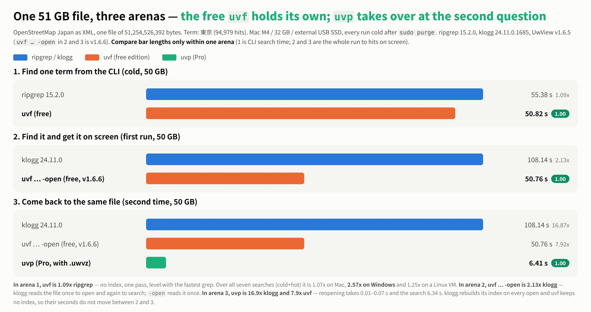
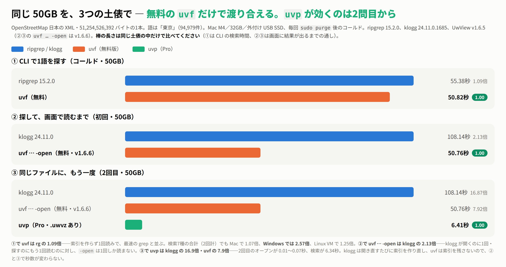

# scoop-uwview

[English](#english) · [日本語](#日本語)

## English

[Scoop](https://scoop.sh) bucket for [UwView](https://github.com/amru195704/UwView): open and search huge text/log files, with the `uvf` command.

**Current version: 1.7.3.5 “Wide Field”** — [release notes](https://github.com/amru195704/UwView/releases/tag/v1.7.3.5)

- Search many files at once: wildcards and `**` for subfolders, skipping files matched by `.gitignore` / `.ignore` (same rules as ripgrep)
- Search compressed files as they decompress: `.gz` `.bz2` `.xz` `.lzma` `.zst` `.lz4` `.br`, mixed with plain text in one run
- Read multi-file results in the viewer, with a file list and tabs

```powershell
scoop bucket add uwview https://github.com/amru195704/scoop-uwview
scoop install uwview
```

This adds a Start menu shortcut "UwView" and puts `uvf` on your PATH.

```powershell
uvf app.log 'ERROR'                  # search
uvf app.log 'ERROR' -open            # search, then show the hits in the viewer
uvf '*.log' 'ERROR'                  # several files at once (always quote the pattern)
uvf 'app.log,app.log.*.gz' 'ERROR'   # plain text and compressed files together
```



*One 51.25 GB file, three arenas. Searching one term from the command line, the free `uvf` is on par with ripgrep. Searching and then reading the hits on screen, `uvf … -open` is about 2× faster than klogg. From the second question on the same file, the paid UwView Pro (`uvp`, not installed by this package) answers in 6.41 s. Compare bars only within the same arena. Mac M4 / external USB SSD / OpenStreetMap XML, v1.6.6; results vary by machine. Details: [benchmarks](https://uvp.y42u.net/en/benchmarks-en/).*

Update: `scoop update uwview` · Remove: `scoop uninstall uwview`

The manifest downloads the official archive from [GitHub Releases](https://github.com/amru195704/UwView/releases) and checks its SHA256. No files are re-hosted here. The Windows build is not code-signed yet, so SmartScreen may ask on first launch (More info → Run anyway).

License of UwView: PolyForm Internal Use 1.0.0, free for personal and internal business use. See [LICENSE](https://github.com/amru195704/UwView/blob/main/LICENSE).

## 日本語

[UwView](https://github.com/amru195704/UwView) の [Scoop](https://scoop.sh) bucket です。巨大なテキスト／ログファイルを開いて探すアプリと、`uvf` コマンドが入ります。

**現在の版: 1.7.3.5「Wide Field」** — [リリースノート](https://github.com/amru195704/UwView/releases/tag/v1.7.3.5)

- 複数のファイルをまとめて探せます（ワイルドカード・サブフォルダーの `**`。`.gitignore`・`.ignore` に当たるファイルは ripgrep と同じ規則で外します）
- 圧縮ファイルを展開しながら探せます（`.gz` `.bz2` `.xz` `.lzma` `.zst` `.lz4` `.br`。平文と混ぜて1回で）
- 複数ファイルの結果を画面で読めます（ファイル一覧とタブつき）

```powershell
scoop bucket add uwview https://github.com/amru195704/scoop-uwview
scoop install uwview
```

スタートメニューに「UwView」が追加され、`uvf` コマンドがそのまま使えるようになります。

```powershell
uvf app.log 'ERROR'                  # 探す
uvf app.log 'ERROR' -open            # 探して、当たりをそのまま画面で読む
uvf '*.log' 'ERROR'                  # 複数のファイルをまとめて（指定は必ず引用符で囲む）
uvf 'app.log,app.log.*.gz' 'ERROR'   # 平文と圧縮ファイルを混ぜて
```



*同じ 51.25GB のファイルを3つの土俵で。コマンドで1語を探すなら、無料の `uvf` で ripgrep と同等。探して画面で読むまでなら、`uvf … -open` が klogg の約2倍。同じファイルに戻る2回目からは、有料の UwView Pro（`uvp`・このパッケージには含まれません）が 6.41秒で答えます。棒の長さは同じ土俵の中だけで比べてください。Mac M4・外付け USB SSD・OpenStreetMap XML・v1.6.6 での実測で、環境により異なります。詳しくは [実測まとめ](https://uvp.y42u.net/benchmarks/)。*

更新: `scoop update uwview` ／ 削除: `scoop uninstall uwview`

公式の zip を [GitHub Releases](https://github.com/amru195704/UwView/releases) から取得し、SHA256 を照合します。このリポジトリにアプリ本体は置いていません。Windows 版はまだコード署名していないため、初回起動時に SmartScreen が出ることがあります（「詳細情報」→「実行」）。

UwView のライセンス: PolyForm Internal Use 1.0.0（個人利用・企業の社内業務利用は無料）。[LICENSE](https://github.com/amru195704/UwView/blob/main/LICENSE) をご覧ください。
